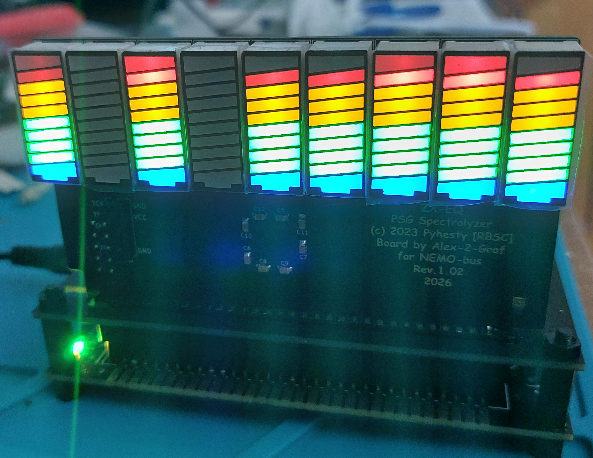
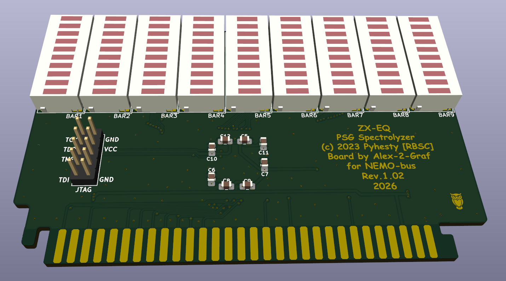
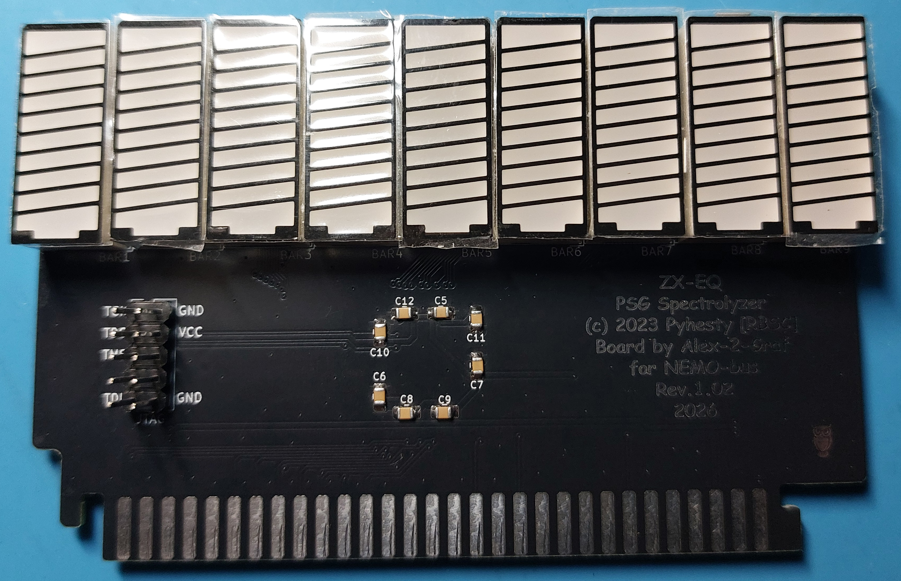
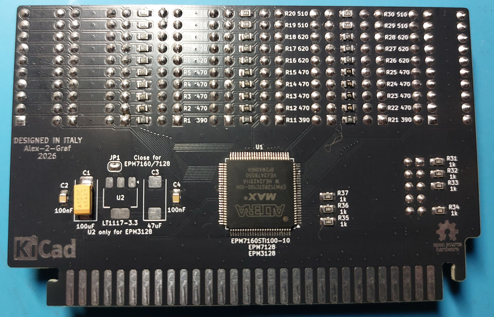
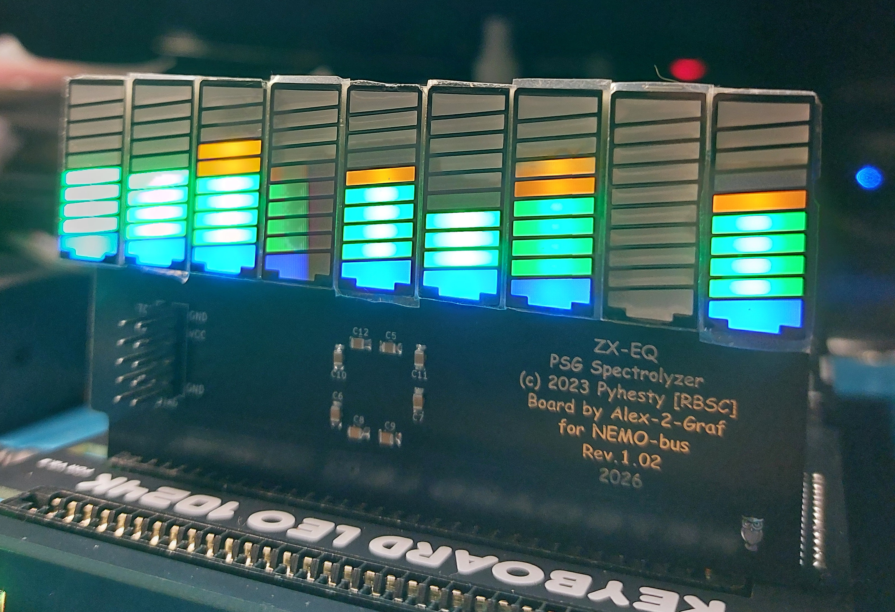

# ZX-EQ Nemo-bus Edition (Universal CPLD)  
Spectrolyzer Cartridge for ZX Spectrum  
  
> [English](README.en.md) | [Русский](README.md)  
  
  
  
---
  
## Описание проекта  
  
**ZX-EQ** — это аппаратный спектроанализатор (картридж расширения) для компьютера ZX Spectrum, созданный по мотивам оригинального проекта группы **RBSC**. Устройство в реальном времени визуализирует проигрываемые частоты и ноты в играх и демо-сценах с помощью светодиодных шкал (LED bars).  
  
Сердцем устройства является CPLD-чип **Altera (Intel) MAX (EPM7160STC100)**.  
  
> **Важно:** Данный репозиторий базируется на разработках [RBSC/ZX-EQ](https://github.com/RBSC/ZX-EQ). Все изменения внесены с уважением к оригинальному авторству.  
  
---
  
## Ключевые изменения:
1. **Шина Nemo-bus:** Плата вставляется напрямую в слоты ZX-Evolution, Scorpion, Kay, ZXM-Phoenix.
2. **Мульти-CPLD схема:** Плата разведена с учетом универсального питания и толерантности к логическим уровням. Поддерживаются три типа микросхем ПЛИС в корпусе TQFP-100:
   * **Altera MAX 7000S:** EPM7128STC100 / EPM7160STC100 (+5V питание).
   * **Altera MAX 3000A:** EPM3128ATC100 (+3.3V питание, входы толерантны к +5V шины Nemo-bus).
  
---
  
## Важные особенности сборки (BOM & Jumper Settings)  
  
В зависимости от выбранного чипа ПЛИС, конфигурация платы меняется:  
  
### 1. Вариант на EPM3128ATC100 (+3.3V)
* **Стабилизатор:** Обязательно запаивается LDO-регулятор (например, LT1117-3.3) для питания ядра ПЛИС.
* **Перемычка (Джампер):** Оставте джампер JP1 выбора питания открытым.
* **Прошивка:** Используйте POF/JED файл, скомпилированный именно под семейство MAX3000A.
  
### 2. Вариант на EPM7128STC100 / EPM7160STC100 (+5V)
* **Стабилизатор:** Не требуется (также можно не запаивать C3 и C4).
* **Перемычка (Джампер):** Закоротите джампер выбора питания JP1.
* **Прошивка:** Используйте оригинальный POF файл от RBSC под MAX7000S.
  
---
  
## Прошивка ПЛИС (Firmware)
  
Благодаря универсальной разводке питания, проект поддерживает компиляцию под разные поколения CPLD Altera/Intel (MAX 3000A / MAX 7000S) в корпусах TQFP-100.  
  
В данном репозитории учтены наработки оригинального проекта и кастомные модификации. В частности, добавлена полноценная интеграция с **альтернативной прошивкой от [andykarpov/zx-eq-firmware](https://github.com/andykarpov/zx-eq-firmware)**, которая значительно расширяет выбор используемых светодиодных индикаторов.  
  
### Доступные бинарники в папке [Firmware](Firmware):  
  
В зависимости от запаянного чипа и типа ваших LED-столбиков, выберите нужный файл.  
  
---
  
### Как прошить:
1. Подключите программатор **USB Blaster** к JTAG-разъему платы.
2. Подайте питание на Nemo-bus (или внешние +5V на плату, если предусмотрено).
3. Запустите **Quartus Programmer**, выберите ваш `.pof` файл и нажмите **Start**.
  
---
  
## Галерея / Рендеры  
  
  
  
  
  
  
  
  
  
---
  
## Благодарности (Credits)
* **[RBSC (Retro-Computers Breeding Society)](https://github.com)** — авторы оригинальной схемы, логики спектроанализатора и концепта картриджа.
* **[Андрей Карпов (andykarpov)](https://github.com/andykarpov/zx-eq-firmware)** — автор альтернативной прошивки с поддержкой 8-битных шкал и выбора полярности LED.
  
---
  
## Дисклеймер и Лицензия
В соответствии с правилами оригинальных авторов (RBSC):
* Проект предоставляется «как есть» (AS IS), без каких-либо гарантий.
* **Не для коммерческого использования!** Продажа пустых плат в небольших количествах для покрытия расходов на производство (излишки от заказа батча) допускается. Массовое коммерческое производство требует согласования с авторами RBSC.
